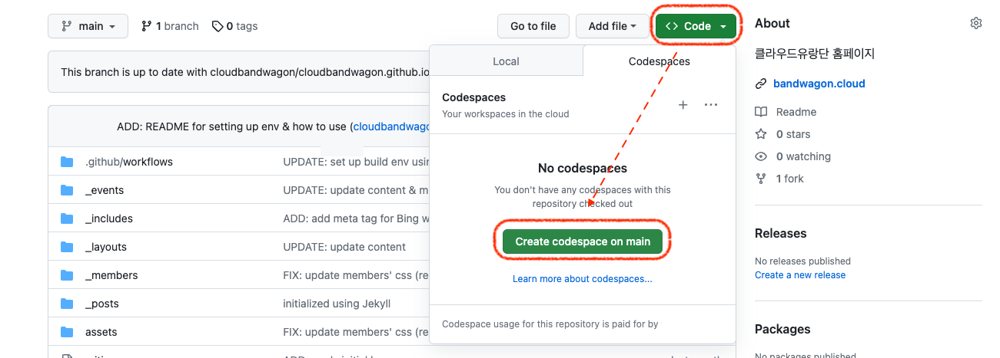

# 클라우드 유랑단 홈페이지

## 소개

- [클라우드 유랑단 홈페이지](https://bandwagon.cloud/)는 [Jekyll](https://jekyllrb.com/)를 사용하여 만들었으며, [GitHub Pages](https://pages.github.com/)로 호스팅합니다.
- 본 저장소의 `main` 브랜치에 반영된 내용은 [GitHub Actions](https://github.com/cloudbandwagon/cloudbandwagon.github.io/actions)가 자동으로 빌드하여 [gh-pages](https://github.com/cloudbandwagon/cloudbandwagon.github.io/tree/gh-pages) 브랜치에 반영합니다.


## 개발 환경 구축하기

### GitHub 코드스페이스

아래는 [GitHub 코드스페이스](https://docs.github.com/ko/codespaces/overview)를 이용해서 개발 환경을 구축하는 방법입니다.

#### 0. 저장소 포크(fork)

- 클라우드 유랑단 홈페이지 저장소를 자신의 GitHub 계정으로 포크(fork)합니다.

#### 1. GitHub 코드스페이스 실행

- 아래 그림과 같이 `[Create codespace on main]` 버튼을 클릭합니다

  

#### 2. Jekyll 실행

- 아래 명령어를 통해 Jekyll을 실행시킵니다.

  ```bash
  bundle exec jekyll serve
  ```

- 아래 그림과 같이 `[Open in Browser]` 버튼을 클릭해서 웹사이트를 확인합니다.

  

- 만약 `_config.yml` 파일 등을 수정하는 경우 `bundle exec jekyll serve`를 다시 실행하여 반영해야 합니다.

### Mac OS

아래는 macOS에서 개발 환경을 구축하는 방법입니다.

#### 0. 저장소 복제(clone)

- 클라우드 유랑단 홈페이지 저장소를 복제한 뒤, 복제한 저장소 디렉토리로 진입합니다.

  ```bash
  git clone https://github.com/cloudbandwagon/cloudbandwagon.github.io.git
  cd cloudbandwagon.github.io
  ```

#### 1. Ruby 설치

- [homebrew](https://brew.sh/)를 사용하여 여러 Ruby 버전을 사용할 수 있는 `rbenv`를 설치합니다.

  ```bash
  brew install rbenv
  ```

- `rbenv`를 사용하여 본 저장소에서 사용 중인 Ruby 버전에 맞는 Ruby를 설치하고, 설정합니다.

  ```bash
  rbenv install `cat .ruby-version` # Ruby 설치
  rbenv local `cat .ruby-version`   # Ruby 설정
  ```

#### 2. Jekyll 설치

- `bundler`를 설치하고, Jekyll 및 필요 패키지들을 설치합니다.

  ```bash
  gem install jekyll bundler
  bundle install
  ```

#### 3. Jekyll 실행

- Jekyll을 실행하고, `http://localhost:4000`으로 접속하여 확인합니다.

  ```bash
  bundle exec jekyll serve
  open http://localhost:4000
  ```

- `_config.yml` 파일 등을 수정하는 경우 `jekyll serve`를 다시 실행하여 반영하셔야 합니다.


## 사용법

[HOW_TO_USE.md](./HOW_TO_USE.md) 문서를 참고해주세요.
